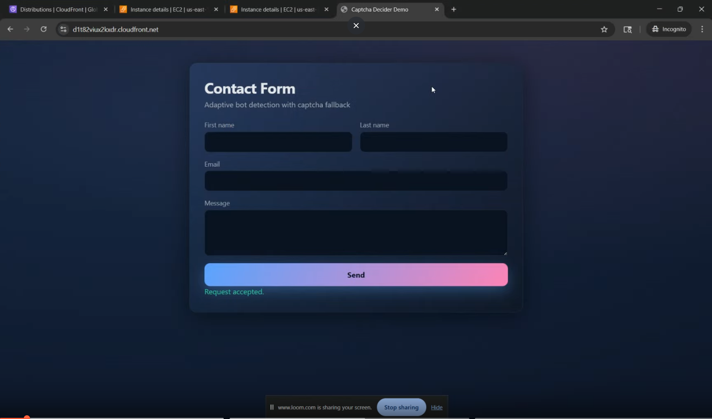

<p align="center">
  
</p>

# Invisible CAPTCHA Engine — Senior Design Project

A behavioral biometrics-based CAPTCHA system that distinguishes humans from bots **invisibly**, without challenge puzzles. The engine collects passive interaction signals (mouse movement, keystroke timing, scroll patterns) and classifies them using a fine-tuned lightweight LLM.

**Team:** George Mason University — Senior Design Capstone CYSE 2026
**Group Members:** Pragalv Bhattarai, Raymond Quan, Faizan Munir, Logan Breckenridge, Jeremiah Mccormick, Saipradhith Gudapati

**Sponsor:** Dr. MingKui Wei
**Mentor:** Dr. Jair Ferrari

---

## Demo Video

<p align="center">
  <a href="https://www.loom.com/share/40302f2b666c4f318d417ff8a0535e99">
    
  </a>
</p>

<p align="center"><i>Click the image above to watch the demo on Loom.</i></p>

---

## Repositories

| Component | Description | Link |
|-----------|-------------|------|
| **Frontend** | React app — collects behavioral biometrics and renders the demo UI | [github.com/RayQCodes/frontend](https://github.com/RayQCodes/frontend) |
| **Backend** | Java Spring Boot API on Tomcat/Nginx — handles requests, sessions, and forwards biometric data to the ML service | [github.com/RayQCodes/Backend](https://github.com/RayQCodes/Backend) |
| **ML** | Fine-tuned Gemma 2-bit (LoRA) model for human-vs-bot classification | [github.com/RayQCodes/ML-Model](https://github.com/RayQCodes/ML-Model) |

---

## Deployment Architecture

The system runs on **two AWS EC2 instances**:

- **EC2 #1 (Web Server):** hosts both the React frontend and the Spring Boot backend, served through Tomcat behind Nginx
- **EC2 #2 (GPU Instance):** hosts the ML inference service (Gemma 2-bit + LoRA)

```
[ User Browser ]
       |
       |  behavioral signals (mouse, keys, scroll)
       v
+---------------------------------------+
|  EC2 #1 — Web Server                  |
|  Nginx -> Tomcat                      |
|    - React frontend                   |
|    - Spring Boot backend              |
+---------------------------------------+
       |
       |  inference request
       v
+---------------------------------------+
|  EC2 #2 — GPU Instance                |
|    - Gemma 2-bit + LoRA               |
|    - human / bot verdict              |
+---------------------------------------+
```

---

## How to Run Locally

Each repo has its own README with setup steps. Quick start:

1. Clone all three repos into the same parent folder.
2. Start the ML service first (it takes the longest to warm up).
3. Start the backend, then the frontend.
4. Open `http://localhost:3000` and interact with the demo page.

---

## Resources

- **Research Paper (IEEE format):** [View on Overleaf](https://www.overleaf.com/read/sqnqrfnrrnvr#fc09c9)
- **Demo Video:** [Watch on Loom](https://www.loom.com/share/40302f2b666c4f318d417ff8a0535e99)
- **Poster:** [View on Google Drive](https://drive.google.com/file/d/18VEHJeMZ1P2fGnl4eWRLEoqMJATKX7Ly/view?usp=sharing)

---

## Tech Stack

- **Languages:** Java, JavaScript (React), Python
- **Cloud:** AWS EC2 (web server + GPU instance)
- **Web:** Tomcat, Nginx, Spring Boot
- **ML:** Gemma 2B, LoRA fine-tuning, Hugging Face Transformers
- **Docs:** LaTeX (IEEE template)

---

## License

See `LICENSE` in each repository.